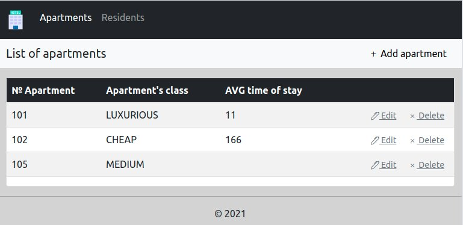
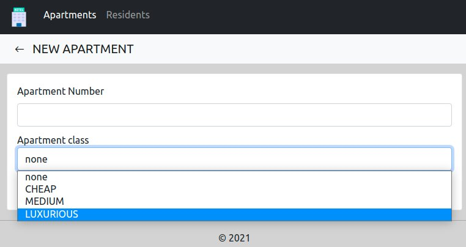
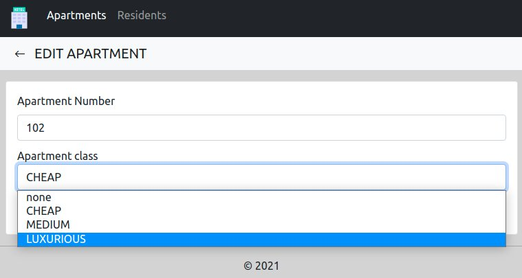
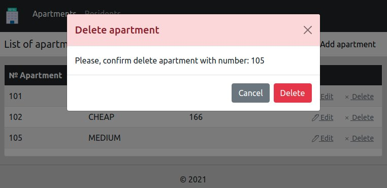
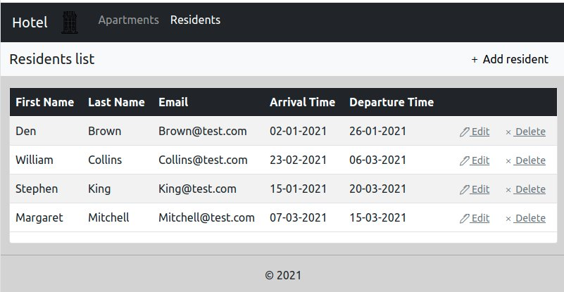
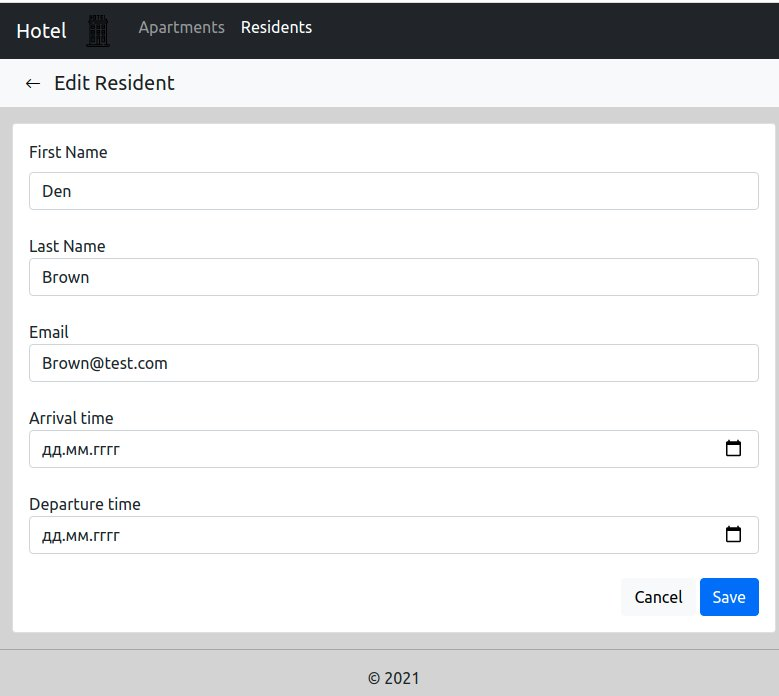
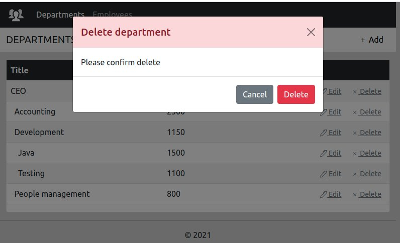

Функциональная спецификация программы «номера и постояльцы».

# Номера и постояльцы
## 1. Видение
Требуется создать рабочий прототип Web приложения для работы с пользователями.
Приложение должно реализовывать следующие функции:

- Просмотр списка апартаментов и редактирование этого списка.
- Просмотр списка постояльцев и редактирование этого списка.

## 2.1 Просмотр списка апартаментов
Данный режим программы предназначен для просмотра списка апартаментов.
Основной сценарий:

- Пользователь выбирает меню «Apartments».
- Отображается форма просмотра списка всех апартаментов.

Рис. 2.1 Просмотр списка апартаментов

В списке отображаются следующие колонки:

- № Apartment — номер апартаментов.
- Apartment's class — класс апартаментов.
- AVG time  of stay — средняя продолжительность пребывания в апартаментах.

## 2.2. Добавление апартамента
#### 	Основной сценарий:
- Пользователь находясь в режиме просмотра списка апартаментов нажимает кнопку «Add apartment»;
- Отображается страница для добавления нового апартамента;
- Пользователь вводит данные и нажимает кнопку “Save”;
- Если данные введены не корректно, то отображается предупреждение о вводе некорректных данных;
- Если данные корректны, то апартаменты добавляются в базу данных;
- Если апартаменты успешно добавлены, то открывается страница просмотра списка апартаментов с обновленными данными.

#### 	Сценарий отмены изменений:
- Пользователь находясь в режиме просмотра списка апартаментов нажимает кнопку «Add apartment»;
- Отображается страница добавления;
- Пользователь вводит данные и нажимает кнопку «Cancel»;
- Данные не сохраняются в базу данных и открывается страница просмотра списка апартаментов с прежними данными.

При добавлении апартаментов вводятся следующие реквизиты:

- № Apartment — номер апартаментов.
- Apartment's class — класс апартаментов.

Рис. 2.2 Добавление апартаментов

## 2.3. Редактирование апартаментов
#### 	Основной сценарий:
- Пользователь находясь в режиме просмотра списка апартаментов нажимает кнопку «Edit»;
- Отображается страница для редактирования;
- Пользователь вводит данные и нажимает кнопку “Save”;
- Если данные введены не корректно, то отображается предупреждение о вводе некорректных данных;
- Если данные корректны, то апартаменты обновляются в базе данных;
- Если постоялец успешно добавлен, то открывается страница просмотра списка апартаментов с обновленными данными.

#### 	Сценарий отмены изменений:
- Пользователь находясь в режиме просмотра списка апартаментов нажимает кнопку «Edit»;
- Отображается страница для редактирования;
- Пользователь вводит данные и нажимает кнопку «Cancel»;
- Данные не сохраняются в базу данных и открывается страница просмотра списка апартаментов с прежними данными.

При редактировании апартаментов вводятся следующие реквизиты:

- № Apartment — номер апартаментов.
- Apartment's class — класс апартаментов.

Рис. 2.3 Редактирование апартаментов

#### 	Ограничения валидации данных:
- № Apartment  — обязательное поле, должно быть уникальным.
- Apartment's class — обязательное поле, длина не более 30 символов.

## 2.4. Удаление апартаментов
#### 	Основной сценарий:
- Пользователь находясь в режиме просмотра списка апартаментов нажимает кнопку «Delete» в строке выбранных апартаментов;
- Отображается диалог подтверждения на удаление: «Delete apartment. Please confirm delete apartment with number:»;
- Пользователь нажимает кнопку «Delete»;
- Происходит удаление апартаментов в базе данных;
- Если апартаменты успешно удалены, то открывается страница просмотра списка апартаментов с обновленными данными.

#### 	Cценарий отмены удаления:
- Пользователь находясь в режиме просмотра списка апартаментов нажимает кнопку «Delete» в строке выбранных апартаментов;
- Отображается диалог подтверждения на удаление: «Delete apartment. Please confirm delete apartment with number:»;
- Пользователь нажимает кнопку «Cancel»;
- Открывается форма просмотра списка апартаментов с прежними данными.

Рис. 2.4 Удаление апартаментов

## 3.1 Просмотр списка постояльцев
Данный режим программы предназначен для просмотра списка постояльцев.
Основной сценарий:

- Пользователь выбирает меню «Residents».
- Отображается форма просмотра списка всех постояльцев.

Рис. 3.1 Просмотр списка постояльцев

В списке отображаются следующие колонки:

- First Name — имя постояльца.
- Last Name — фамилия постояльца.
- Email — email постояльца.
- Arrival Time — дата прибытия постояльца.
- Departure Time — дата отъезда.

## 3.2. Добавление постояльца
#### 	Основной сценарий:
- Пользователь находясь в режиме просмотра списка постояльцев нажимает кнопку «Add resident»;
- Отображается страница для добавления нового постояльца;
- Пользователь вводит данные и нажимает кнопку “Save”;
- Если данные введены не корректно, то отображается предупреждение о вводе некорректных данных;
- Если данные корректны, то постоялец добавляется в базу данных;
- Если постоялец успешно добавлен, то открывается страница просмотра списка постояльцев с обновленными данными.

#### 	Сценарий отмены изменений:
- Пользователь находясь в режиме просмотра списка постояльцев нажимает кнопку «Add resident»;
- Отображается страница добавления;
- Пользователь вводит данные и нажимает кнопку «Cancel»;
- Данные не сохраняются в базу данных и открывается страница просмотра списка постояльцев с прежними данными.

При добавлении постояльца вводятся следующие реквизиты:

- First Name — имя постояльца.
- Last Name — фамилия постояльца.
- Email — email постояльца.
- Arrival Time — дата прибытия постояльца.
- Departure Time — дата отъезда.

Рис. 3.2 Добавление постояльца

## 3.3. Редактирование постояльца
#### 	Основной сценарий:
- Пользователь находясь в режиме просмотра списка постояльцев нажимает кнопку «Edit»;
- Отображается страница для редактирования;
- Пользователь вводит данные и нажимает кнопку “Save”;
- Если данные введены не корректно, то отображается предупреждение о вводе некорректных данных;
- Если данные корректны, то постоялец обновляется в базе данных;
- Если постоялец успешно добавлен, то открывается страница просмотра списка постояльцев с обновленными данными.

#### 	Сценарий отмены изменений:
- Пользователь находясь в режиме просмотра списка постояльцев нажимает кнопку «Edit»;
- Отображается страница для редактирования;
- Пользователь вводит данные и нажимает кнопку «Cancel»;
- Данные не сохраняются в базу данных и открывается страница просмотра списка постояльцев с прежними данными.

При редактировании постояльца вводятся следующие реквизиты:

- First Name — имя постояльца.
- Last Name — фамилия постояльца.
- Email — email постояльца.
- Arrival Time — дата прибытия постояльца.
- Departure Time — дата отъезда.

Рис. 3.3 Редактирование постояльца

#### 	Ограничения валидации данных:
- First Name — обязательное поле, длина не более 30 символов.
- Last Name — обязательное поле, длина не более 30 символов.
- Email — обязательное поле, длина не более 30 символов.
- Arrival Time — обязательное поле. Формат даты в виде «дд.мм.гггг».
- Departure Time — обязательное поле. Формат даты в виде «дд.мм.гггг».
- Departure Time не может быть меньше или равно Arrival Time.

## 3.4. Удаление постояльца
#### 	Основной сценарий:
- Пользователь находясь в режиме просмотра списка постояльцев нажимает кнопку «Delete» в строке выбранного постояльца;
- Отображается диалог подтверждения на удаление: «Delete resident. Please confirm delete»;
- Пользователь нажимает кнопку «Delete»;
- Происходит удаление постояльца в базе данных;
- Если постоялец успешно удален, то открывается страница просмотра списка постояльцев с обновленными данными.

#### 	Cценарий отмены удаления:
- Пользователь находясь в режиме просмотра списка постояльцев нажимает кнопку «Delete» в строке выбранного постояльца;
- Отображается диалог подтверждения на удаление: «Delete resident. Please confirm delete»;
- Пользователь нажимает кнопку «Cancel»;
- Открывается форма просмотра списка постояльцев с прежними данными.

Рис. 3.4 Удаление постояльца
